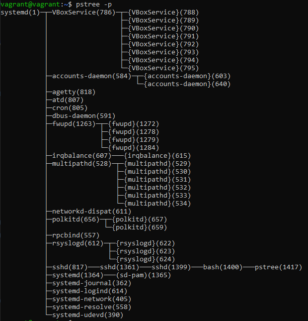

# Домашнее задание к занятию "3.2. Работа в терминале, лекция 2"

1. Какого типа команда `cd`? Попробуйте объяснить, почему она именно такого типа; опишите ход своих мыслей, если считаете что она могла бы быть другого типа.    

> - change directory. Команда взамодействия с файловой стистемой, минимальный набор символов для ее ввода делает ее спользование удобным, при работе в окмандных интерпритаторах.Исплльзуется во многих ОС, к сожалению в разных семействах ОС исползуться разные указатели директорий /-linux, \windows.  

2. Какая альтернатива без pipe команде `grep <some_string> <some_file> | wc -l`? `man grep` поможет в ответе на этот вопрос. Ознакомьтесь с [документом](http://www.smallo.ruhr.de/award.html) о других подобных некорректных вариантах использования pipe.    
> Команда подсчета строк с определнным вхождением символов в фале
grep -c <some_string> <some_file>  

3. Какой процесс с PID `1` является родителем для всех процессов в вашей виртуальной машине Ubuntu 20.04?    
> systemd
> 
> 
  

4. Как будет выглядеть команда, которая перенаправит вывод stderr `ls` на другую сессию терминала?  

Вызов из pts/0:  


  
5. Получится ли одновременно передать команде файл на stdin и вывести ее stdout в другой файл? Приведите работающий пример.  
  


6. Получится ли вывести находясь в графическом режиме данные из PTY в какой-либо из эмуляторов TTY? Сможете ли вы наблюдать выводимые данные?    
>Вывести получится при использовании перенаправлении вывода:
vagrant$ tty  
/dev/pts/3  
vagrant$ echo Hello tty3 >/dev/tty3  
для просмотра нужно переключиться в контекст TTY  
vagrant$ Hello tty3  

7. Выполните команду `bash 5>&1`. К чему она приведет? Что будет, если вы выполните `echo netology > /proc/$$/fd/5`? Почему так происходит?    
>bash 5>&1 - Создаст дескриптор с 5 и перенатправит его в stdout
echo netology > /proc/$$/fd/5 - выведет в дескриптор "5", который был пернеаправлен в stdout сообщение.

  

8. Получится ли в качестве входного потока для pipe использовать только stderr команды, не потеряв при этом отображение stdout на pty? Напоминаем: по умолчанию через pipe передается только stdout команды слева от `|` на stdin команды справа.
Это можно сделать, поменяв стандартные потоки местами через промежуточный новый дескриптор, который вы научились создавать в предыдущем вопросе.    

>
9>&2 - новый дескриптор перенаправили в stderr  
2>&1 - stderr перенаправили в stdout  
1>&9 - stdout - перенаправили в в новый дескриптор  


9. Что выведет команда `cat /proc/$$/environ`? Как еще можно получить аналогичный по содержанию вывод?    
>Будут выведены переменные окружения.
Команды аналоги printenv, env.  

10. Используя `man`, опишите что доступно по адресам `/proc/<PID>/cmdline`, `/proc/<PID>/exe`.     
>/proc/<PID>/cmdline - полный путь до исполняемого файла процесса [PID]
/proc/<PID>/exe - содержит ссылку до файла запущенного для процесса [PID],
                        cat выведет содержимое запущенного файла,
                        запуск этого файла,  запустит еще одну копию самого файла   


11. Узнайте, какую наиболее старшую версию набора инструкций SSE поддерживает ваш процессор с помощью `/proc/cpuinfo`.  
>grep sse /proc/cpuinfo  
> sse4_2


12. При открытии нового окна терминала и `vagrant ssh` создается новая сессия и выделяется pty. Это можно подтвердить командой `tty`, которая упоминалась в лекции 3.2. Однако:

     ```bash
     vagrant@netology1:~$ ssh localhost 'tty'
     not a tty
     ```

     Почитайте, почему так происходит, и как изменить поведение.  

>при подключении ожидается пользователь, а не другой процесс
изменить поведение чтобы команда выполнилась -t тогда принудительно создается псевдотерминал. 
> ssh -t localhost 'tty'   
> 


13. Бывает, что есть необходимость переместить запущенный процесс из одной сессии в другую. Попробуйте сделать это, воспользовавшись `reptyr`. Например, так можно перенести в `screen` процесс, который вы запустили по ошибке в обычной SSH-сессии.  
>Запустим длительный процесс top
Фон процесса с помощью CTRL-Z
Возобновим процесс в фоновом режиме: bg
Отключить задания от текущего родителя с помощью disown top.
Запустим screen
ps -a смотрим pid у top
Подключиться к фоновому процессу: reptyr 951 (в моем случае)
(Ошибка на параметры  10-patrace.conf,после установки заначения  kernel.yama.ptrace_scope = 0)
После применения параметров перезагрузки.
И повторения начальных шагов процесс передается.  


14. `sudo echo string > /root/new_file` не даст выполнить перенаправление под обычным пользователем, так как перенаправлением занимается процесс shell'а, который запущен без `sudo` под вашим пользователем. Для решения данной проблемы можно использовать конструкцию `echo string | sudo tee /root/new_file`. Узнайте что делает команда `tee` и почему в отличие от `sudo echo` команда с `sudo tee` будет работать.  
>команда tee делает вывод одновременно и в файл, указаный в качестве параметра, и в stdout,
в данном примере команда получает вывод из stdin, перенаправленный через pipe от stdout команды echo
и так как команда запущена от sudo , соотвественно имеет права на запись в файл.
 

